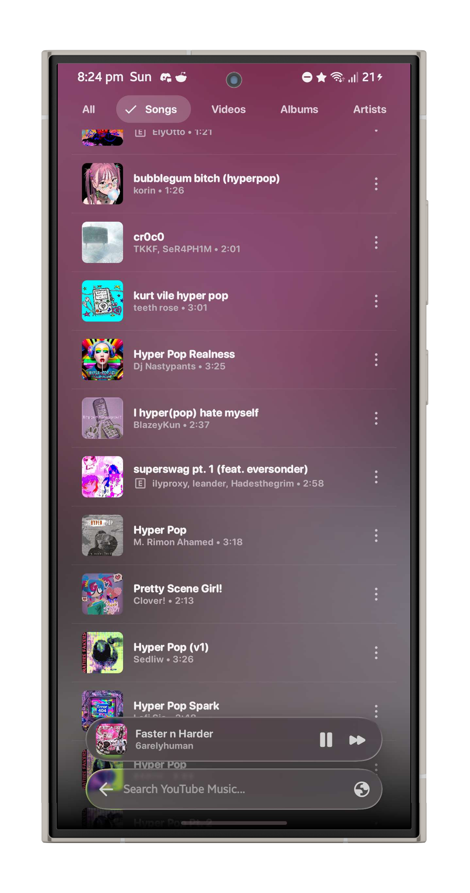
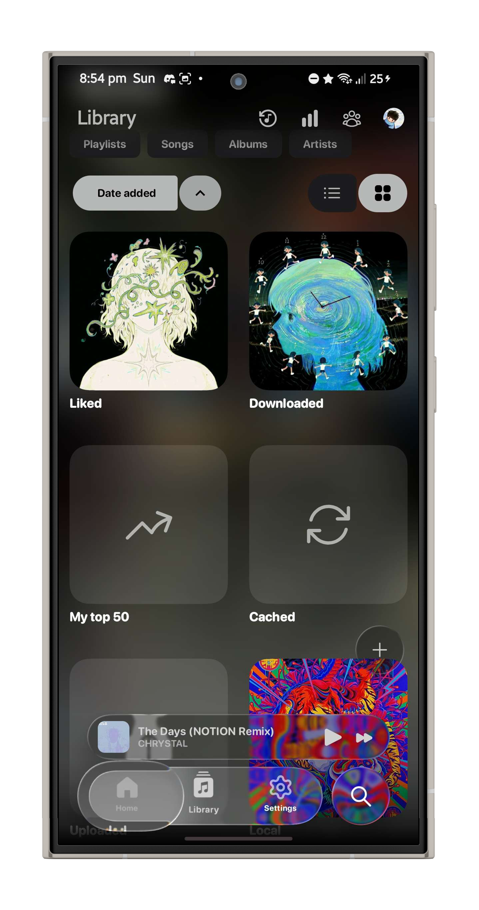
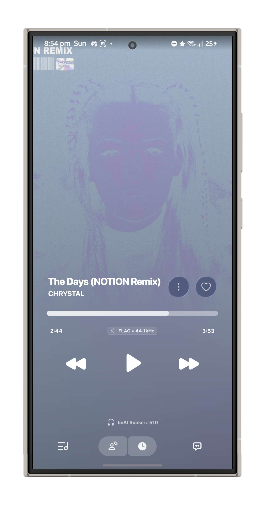
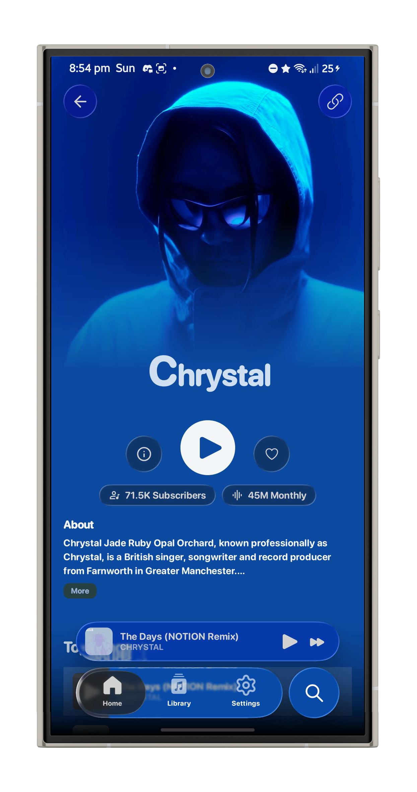

<h2 align="center">
  

  <h1>convx</h1>
  <h3>Convx is an open-source, Liquid Glass music player for Android</h3>

  

    
  

  

    <b><a href="https://github.com/cosmictaserdev-creator/Convx/releases/tag/v1.5.2">⬇️ DOWNLOAD CONVX 1.5.2</a></b>
    — Latest release. Works on Android 8.0+.
  

  <h3>📸 Screenshots</h3>
  

    
    
    
     
    
    
    
     
    
    
    
     
    
    
    
     
    
    
    
     
    
    
    
     
    
    
  

  

    
    
    
    
    
  

  

    ☕ <b>Support:</b> <a href="https://ko-fi.com/cosmictaser">Ko-fi</a> &nbsp;•&nbsp;
    💸 <b>UPI:</b> <code>cosmictaser@okicici</code> &nbsp;•&nbsp;
    🌐 <b>Website:</b> <a href="https://cosmictaser.de5.net">cosmictaser.de5.net</a>
  

<h2>🎵 About Convx</h2>

<b>Convx</b> is a free, open-source music player for Android that streams from YouTube Music, built with <b>Jetpack Compose</b> on a <b>Media3</b> ExoPlayer core. The UI is a custom <b>Liquid Glass</b> design system — frosted, refractive surfaces, iOS-style bouncy scrolling, and progressive blur chrome — instead of stock Material widgets.

Convx started as a fork of <a href="https://github.com/vivizzz007/vivi-music">vivi-music</a>; see <a href="#-credits">Credits</a> below.

<h2>✨ Features</h2>

<table align="center" width="100%">
  <tr valign="top">
    <td width="50%">
      <h3>🧊 Liquid Glass UI</h3>
      <ul>
        <li><b>Real backdrop blur:</b> frosted glass chrome (nav bar, floating buttons, sheets) that actually samples and refracts the content behind it, not a flat translucent color.</li>
        <li><b>iOS-style motion:</b> bouncy rubber-band overscroll, blurred page transitions, springy nav puck.</li>
        <li><b>Material You:</b> adaptive colors pulled from the currently playing artwork.</li>
      </ul>
    </td>
    <td width="50%">
      <h3>🎵 Streaming</h3>
      <ul>
        <li><b>Full YT Music catalog:</b> ad-free streaming and background playback with full notification/lock-screen controls.</li>
        <li><b>Offline downloads:</b> cache tracks locally with smart storage management.</li>
        <li><b>Lossless/high-quality audio</b> and a built-in equalizer.</li>
      </ul>
    </td>
  </tr>
  <tr valign="top">
    <td width="50%">
      <h3>📝 Lyrics & Social</h3>
      <ul>
        <li><b>Synced, karaoke-style lyrics</b> with word-by-word highlighting.</li>
        <li><b>Discord Rich Presence:</b> show what you're listening to on your profile.</li>
        <li><b>Listen Together:</b> sync playback with friends in real time.</li>
      </ul>
    </td>
    <td width="50%">
      <h3>🛡️ Privacy & Updates</h3>
      <ul>
        <li><b>Zero telemetry:</b> no trackers, no analytics, fully local library and preferences.</li>
        <li><b>Built-in updater:</b> in-app update checks and changelogs, no third-party store required.</li>
      </ul>
    </td>
  </tr>
</table>

<h2>🏗️ Architecture</h2>

Quick map for contributors — see <a href="CONTRIBUTING.md">CONTRIBUTING.md</a> for the full guide.

<ul>
  <li><b>UI:</b> Jetpack Compose, MVVM (<code>ui/screens</code> + <code>viewmodels</code>), navigated via <code>ui/screens/NavigationBuilder.kt</code>.</li>
  <li><b>Liquid Glass:</b> <code>ui/component/GlassEffect.kt</code> exposes <code>Modifier.liquidGlass(...)</code>, built on a vendored, source-included copy of <a href="https://github.com/Kyant0/backdrop">Kyant0/backdrop</a> under <code>ui/component/backdrop/</code>. A <code>Backdrop</code> (usually a <code>rememberLayerBackdrop()</code> attached via <code>Modifier.layerBackdrop(...)</code> to some subtree) captures real pixels; any surface holding a reference to that same backdrop can sample, blur, and refract it through <code>drawBackdrop(...)</code>. The floating nav bar, circular back/share buttons, and sheets are all just glass surfaces sampling a nearby backdrop this way.</li>
  <li><b>Playback:</b> Media3 <code>ExoPlayer</code> service in <code>playback/MusicService.kt</code>.</li>
  <li><b>Data:</b> Room database (<code>db/</code>) for the local library, DataStore for preferences (<code>utils/DataStore.kt</code>, <code>constants/PreferenceKeys.kt</code>).</li>
  <li><b>YouTube Music access:</b> the <code>innertube</code> module — an unofficial InnerTube API client, kept separate from the app module.</li>
  <li><b>Updater:</b> <code>vivimusic/updater/</code> checks GitHub Releases for new versions and handles in-app APK download/install (FOSS/GMS build flavors behave slightly differently — see <code>BuildConfig.CAST_AVAILABLE</code>).</li>
</ul>

<h2>🚗 Android Auto Setup</h2>

If Convx doesn't appear in Android Auto:

<ol>
  <li>Open <strong>Android Auto</strong> on your phone</li>
  <li>Tap the <strong>hamburger menu</strong> (three lines) and go to <strong>Settings</strong></li>
  <li>Scroll to the bottom and tap the <strong>version number</strong> multiple times to enable Developer Settings</li>
  <li>Tap the <strong>three dots menu</strong> (⋮) at the top-right</li>
  <li>Select <strong>Developer settings</strong></li>
  <li>Enable <strong>Unknown sources</strong></li>
  <li>Restart Android Auto and connect to your car</li>
</ol>

<h2>🤝 Contributing</h2>

Contributions are welcome — bug reports, feature requests, and code. Start with <a href="CONTRIBUTING.md">CONTRIBUTING.md</a> for the project layout, build setup, and PR checklist. Short version:

<ol>
  <li>Fork the repository</li>
  <li>Create your feature branch (<code>git checkout -b feature/AmazingFeature</code>)</li>
  <li>Commit your changes (<code>git commit -m 'Add some AmazingFeature'</code>)</li>
  <li>Push to the branch (<code>git push origin feature/AmazingFeature</code>)</li>
  <li>Open a Pull Request</li>
</ol>

<h2>🛡️ Privacy & Data Collection</h2>

At <strong>Convx</strong>, your privacy is our top priority. We believe that your music and data belong exclusively to you.

<ul>
  <li><strong>Zero Data Collection:</strong> we do <strong>not</strong> collect, store, or share any of your personal information, usage habits, or listening history.</li>
  <li><strong>100% Local:</strong> all your settings, downloaded tracks, and offline caches are stored securely on your device.</li>
  <li><strong>No Tracking:</strong> no hidden trackers, analytics, or background services monitoring your activity.</li>
</ul>

<h2>📜 Disclaimer</h2>

This project and its contents are <strong>not affiliated with, funded, authorized, endorsed by, or in any way associated with</strong> YouTube, Google LLC, or any of their affiliates and subsidiaries.

Any trademark, service mark, trade name, or other intellectual property rights used in this project are owned by their respective owners.

<strong>Convx</strong> is an independent project created for educational and personal use purposes.

<h2>📄 License</h2>

This project is licensed under the terms specified in the <a href="LICENSE">LICENSE</a> file (GPL-3.0).

  <table border="0" cellpadding="15" cellspacing="0" width="85%">
    <tr>
      <td align="center">
        <h3>💬 Community & Support</h3>
        
Connect with other listeners, suggest features, report bugs, and stay updated on releases.

         
        
          
        
          <a href="https://github.com/cosmictaserdev-creator/Convx/issues">🐞 Report Bugs</a> &nbsp;•&nbsp;
          <a href="https://github.com/cosmictaserdev-creator/Convx/discussions">💬 Discussions</a> &nbsp;•&nbsp;
          <a href="https://github.com/cosmictaserdev-creator/Convx/releases">🚀 Releases</a>
        
      </td>
    </tr>
  </table>

  <h2>🙏 Credits</h2>

  
Convx is developed and maintained by <a href="https://github.com/cosmictaserdev-creator">Aryan (CosmicTaser)</a>. See <a href="https://cosmictaser.de5.net">cosmic-taser.netlify.app</a> for the portfolio.

  <table border="0" cellpadding="10" cellspacing="0" width="90%">
    <tr valign="top">
      <td width="40%" align="left">
        <b>💡 Built On</b>
        <ul>
          <li><strong><a href="https://github.com/vivizzz007/vivi-music">vivi-music</a></strong> by <strong>Vividh P Ashokan</strong> — the project Convx was forked from.</li>
          <li>The <strong>Apple Music Player V17</strong> full-screen player style (Settings → Player Theme) is ported from <a href="https://github.com/vivizzz007/vivi-music">vivi-music</a>'s Apple Music player UI, GPL-3.0.</li>
        </ul>
      </td>
      <td width="60%" align="left">
        <b>🎖️ Foundational Projects</b>
        <ul>
          <li><strong><a href="https://github.com/Kyant0/backdrop">Kyant0/backdrop</a></strong> — the real-time backdrop blur/refraction library the Liquid Glass UI is built on.</li>
          <li><strong><a href="https://github.com/better-lyrics/better-lyrics">Better Lyrics</a></strong> and <strong><a href="https://github.com/maxrave-dev/SimpMusic">SimpMusic</a></strong> — synced lyrics.</li>
          <li><strong><a href="https://github.com/ibratabian17/YouLyPlus">YouLyPlus</a></strong> — in-app lyrics styling.</li>
          <li><strong><a href="https://github.com/monochrome-music/monochrome">Monochrome</a></strong> — the animated visualizer canvas.</li>
        </ul>
      </td>
    </tr>
  </table>

   
  
The open-source community for tools, libraries, and APIs that make this project possible.

  

  
<strong>Made with ❤️ for music lovers everywhere</strong>

  
⭐ Star this repo if you enjoy Convx!

# covx

# Social Media

<h2 align="center">

  

<h2>Contact me:  

  

</h2>

# Follow Me :
‎‎
‎
‎
‎
‎

‎‎
‎
‎
‎
‎
‎
‎
